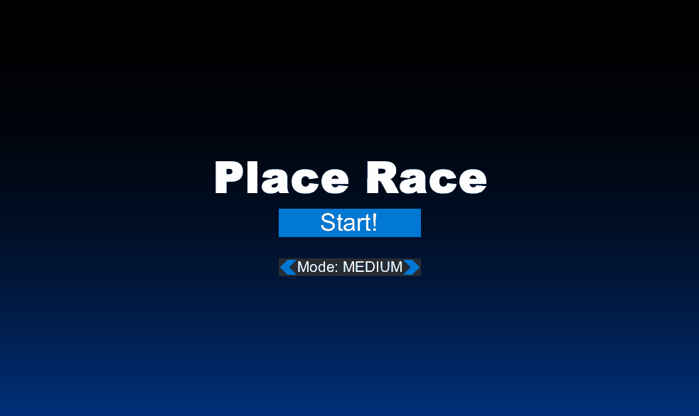
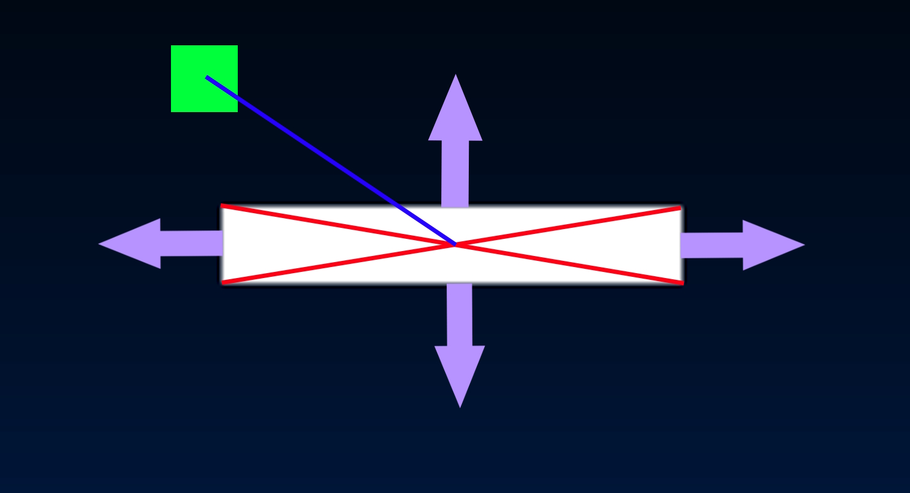
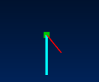

Note: Say that the Platform code is located in UIPhysics Library

# PlaceRace 2D Platformer

PlaceRace is a little game developed with inspiration from other 2D challenge platformers in mind including Geometry Dash or Flappy Bird
This game uses true physics equtions and unique collision code to make sure everything runs smoothly and intuitive

*Premise*
- PlaceRace is a game where you are racing against the clock! The world is filled with barriers and is it constantly speeding up!
- You must place platforms infront of you in order to progress. Watch out, each platform has a cooldown to place!
- How high can your score get?

# Physics Engine
*Description*
- The physics engine in this game is very intuitive.
- Objects and the player are all moved using the Kinematics Equations
- All objects can have forces applied including Friction and Gravity
  - Friction is calculated in the form of Static & Kinetic using each platform as its base with a custom coefficient

*Platform Collision Algorithm*

- Platf0rms in the game use a special collision algorithm that works from all sides.
- A vector is drawn from the center to each corner of the platform.
- A vector is then drawn from the player to the center.
- Using the angle from the player's vector, whatever cross the vector lies between, the player will be pushed in that direction

- The image shows the blue line (player vector) in the top wedge of the platform
- When the player touches the platofrm, it will activate the push towards the top, as the vector angle is in that quadrant
 
*Debug Force Vectors*
- Using Ctrl+Shft+G, the game will enter debug mode
- Debug mode will draw the Velocity Vector (Red) and the Force Vector (Blue) for each object on screen
- The image example shows the net force acting as the gravity force and the velocity being pulled down by that force
  

